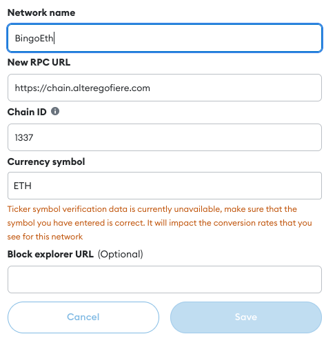
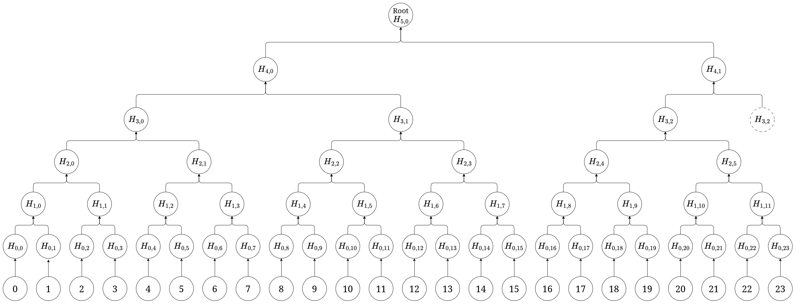
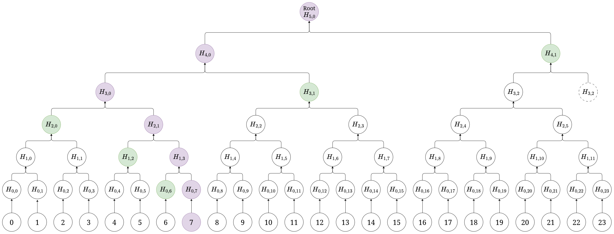
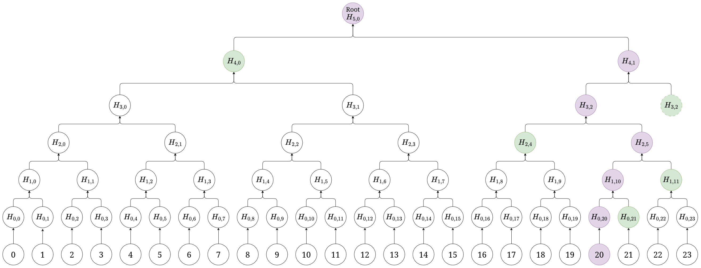

---
author:
    - "Leonardo Manneschi"
    - "Leonardo Scoppitto"
classoption: a4paper
documentclass: article
fontsize: 11pt
geometry: "left=2cm,right=2cm,top=2cm,bottom=2cm"
output:
    pdf_document:
        latex_engine: xelatex
title: BingoEth
subtitle: Relazione progetto P2P
header-includes: |
    \usepackage{dirtree}

---
\pagenumbering{gobble}
\hypersetup{linkcolor=cyan}

\pagebreak
\renewcommand{\contentsname}{Indice}
\tableofcontents
\pagebreak
\pagenumbering{arabic}
\setcounter{page}{1}

# Introduzione

L'applicazione sviluppata come progetto finale del corso di Peer To Peer & Blockchains si chiama BingoEth e si tratta di un'implementazione del bingo (la versione più famosa del bingo, quella americana con cartelle da 75 numeri) realizzata in React/javascript per la parte di front-end e in Solidity per la parte di smart contract, utilizzando truffle com framework.
Link ai repository del progetto:

- Leonardo Manneschi - repository di lavoro [https://github.com/leomanne/P2P_Project](https://github.com/leomanne/P2P_Project)
- Leonardo Scoppitto - mirror del repository di lavoro [https://github.com/leomanne/P2P_Project](https://github.com/skiby7/BingoEth)

# Struttura del progetto

Il progetto è stato organizzato come segue:

\dirtree{%
.1 client $\rightarrow$ \small{Codice del client scritto in React}.
.1 docs $\rightarrow$ \small{Directory contenente la relazione del progetto}.
.1 truffle $\rightarrow$ \small{Root del progetto dello smart contract}.
.2 contracts.
.3 Bingo.sol $\rightarrow$ \small{Sorgente del contratto}.
.2 migrations.
.3 1\_deploy\_contract.js $\rightarrow$ \small{Script di deploy del contratto}.
.1 Dockerfile/docker-compose.yml $\rightarrow$ \small{Container docker per il test e il deploy}.
}

È stato scelto di utilizzare un container docker per eseguire sia il test che il deploy del progetto così da uniformare l'ambiente di sviluppo, automatizzare il più possibile i passaggi di compilazione sia del client che dello smart contract e avere un controllo preciso sulle dipendenze del progetto.

# Manuale utente

## Utilizzo dell'istanza pubblica

Per rendere più fruibile l'utilizzo dell'applicazione sviluppata, è stato eseguito il deploy di **BingoEth** su un server privato insieme a un'istanza di Ganache, così da non dover configurare nulla se non la rete su Metamask. È possibile accedere al progetto all'url [https://bingoeth.alteregofiere.com/](https://bingoeth.alteregofiere.com/).

Gli account disponibili con le relative chiavi private sono:

|Account|Chiave privata|
|:-----:|:------------:|
| \scriptsize `0xC2F7...8A8a` |\scriptsize `0x99409bd109959b84aae9234ce755a39a6df4c009a53c6a81ea0713d65bd80eb7` |
| \scriptsize `0x3530...587c` |\scriptsize `0x98d1ccd915ef23a2a088dfec9a47960f7de3b71d5f3c2aff53b7cb85e411adc5` |
| \scriptsize `0x97f4...e766` |\scriptsize `0xe41c4f1aad19f7238246df7712f748c5cf4d6ac1c8a78e1b3aafb4a74e6ae39d` |
| \scriptsize `0x0fac...b78E` |\scriptsize `0x42941bc9871700dade0f40b607a8e0528fd9578dbefcf4abe6b4f4b2eea817b0` |
| \scriptsize `0x2b61...d04a` |\scriptsize `0x7a956b721714c8708ff22b25b193dae7efc7eaec77fe5b40c5c2944fc42feebe` |
| \scriptsize `0x9307...d846` |\scriptsize `0x9d19b8c0ad94ac66122485684d44bfa782dd84def2c2382b991f3632f3b9a294` |
| \scriptsize `0x7670...a59A` |\scriptsize `0x8b93665547a073f7055c043ce4e6115a13e0900d18e23d206c9b0b17f8bf27e8` |
| \scriptsize `0x1923...2a90` |\scriptsize `0x93c2d0ce2d1398fd5585c348a7befd000fecfebd0c9d5005550e820317ab0a47` |
| \scriptsize `0xc074...Bf56` |\scriptsize `0xd994441bc950b1d80191c8a0454a7b186a3562a8cf486390d4f740a713384d81` |
| \scriptsize `0xe50a...00B1` |\scriptsize `0x9f6e155cd2faf86bb96331732d9f5c6727fe0858773d7ad141f67425e7b1fe1b` |

\pagebreak


La configurazione della rete su MetaMask è la seguente:

{width=30%}


## Esecuzione da sorgente

> *Nota: per l'utilizzo del progetto è consigliato avere docker (consultare [https://docs.docker.com/get-docker/](https://docs.docker.com/get-docker/)) installato sul proprio pc.*

Steps:

1. Clonare il repository da [https://github.com/leomanne/P2P_Project](https://github.com/leomanne/P2P_Project) o da [https://github.com/skiby7/BingoEth](https://github.com/skiby7/BingoEth) (il secondo repository è il mirror del primo) o scompattare l'archivio BingoEth.zip
2. Aprire il terminale/powershell e spostarsi dentro la directory del progetto
3. Eseguire il comando `docker compose up`

Eseguiti i passi indicati, inizierà il processo di build del container docker (ci vorrà qualche minuto). Dopodiché si avvierà il container che compilerà il contratto, per poi avviare l'applicazione **BingoEth**.
Una volta terminato il processo di build, sarà possibile accedere all'applicazione tramite browser all'url [http://localhost:80](http://localhost:80).

Gli account verranno configurati su un'istanza di ganache locale all'indirizzo (`http://127.0.0.1:7545`).

\pagebreak

# Funzionamento del progetto

## Lato front-end

Il front-end dell'applicazione BingoEth è stato sviluppato in React e consente agli utenti di interagire con lo smart contract e poter quindi giocare a bingo scommettendo Ethereum. Le principali funzionalità del front-end sono:

- Creazione di una nuova partita scegliendo il numero massimo di giocatori (oltre al creatore) e la cifra da scommettere.
- Partecipazione a una partita random.
- Partecipazione a una partita di cui si conosce l'ID.


In Figura 1 possiamo visualizzare la schermata principale della dApp sviluppata.

{ width=50% }


### Creazione partita


Per creare la stanza (Figura 2) è necessario inserire il numero massimo di giocatori e l'importo della scommessa per partecipare. Per semplicità di interazione col contratto è stato deciso che non è possibile scommettere frazioni di Ethereum. Una volta inseriti i dati, il pulsante `Scommetti` si abiliterà e, premendolo, verrà chiamata la funzione del contratto `createGame` di cui parleremo nel prossimo capitolo.

{ width=50% }


Solo dopo aver premuto il pulsante scommetti verrà mostrata la schermata di attesa (Figura 3), in cui si aspetterà di raggiungere il numero totale di giocatori scelto al momento della creazione della stanza.

{ width=50% }

**Nota Bene:** il numero di giocatori specificato NON comprende il creatore del gioco, quindi se si specificherà un numero $n$ di giocatori, la partita si svolgerà fra $n+1$ giocatori.

\pagebreak

### Entrare in una stanza

Per accedere a una stanza abbiamo due opzioni:

- scegliere una stanza random
- scegliere una stanza specifica, sapendo l'ID della stanza


Cliccando il pulsante `Entra in una stanza` si aprirà una schermata (Figura 4) in cui verrà richiesto inserire un ID per selezionare il gioco a vogliamo partecipare.

{ width=50% }


Se l'ID selezionato esiste e ci sono ancora posti disponibili allora apparirà la schermata contenente:

- ID della stanza scelta
- Gli Ethereum da scommettere per potersi unire alla stanza
- Il numero di posti ancora disponibili

{ width=50% }


A questo punto, se cliccando sul pulsante `Entra nella stanza`, la somma di Ethereum scommessi verrà prelevata dal wallet e il numero dei giocatori presenti nella stanza verrà aggiornato attraverso la chiamata di funzione del contratto `JoinGame` di cui parleremo nel prossimo capitolo.

Cliccando invece sul pulsante `Entra in una stanza random`, non verrà richiesto nessun ID e verranno visualizzate direttamente le informazioni sul gioco scelto casualmente dal contratto (Figura 5).

### Fase di gioco

Una volta che tutti i giocatori sono entrati la partita verrà avviata e verrà caricata la cartella creata dal client al momento dell'ingresso nella stanza (parleremo meglio di questo argomento nel capitolo sulla sicurezza).

#### Lato Creatore della stanza


Per rendere il gioco più interattivo, è il creatore della stanza che si fa carico della responsabilità estrarre i numeri, chiamando la funzione del contratto `extractNumber`, pertanto è sempre il creatore che detta il ritmo del gioco. Vediamo la schermata di gioco (Figura 6):

{ width=50% }

Come si vede dall'immagine (Figura 6) abbiamo:

- La lista degli ultimi 5 numeri estratti.
- La cartella generata randomicamente lato client. Mano a mano che verranno estratti i numeri, sarà cura dei giocatori tenere traccia delle caselle uscite, come nel vero gioco.
- Un pulsante per estrarre i numeri, chiamando la funzione `extractNumber` del contratto.
- Un pulsante per inviare la propria combinazione vincente al contratto quando si ha una combinazione vincente. Per evitare lo spam di richieste di validazione della cartella da parte del contratto, il pulsante si abilita solo se si seleziona effettivamente una combinazione vincente

\pagebreak

#### Lato Joiner della stanza


Dato che solo il creatore del gioco può estrarre i numeri, abbiamo dato ai joiner della stanza la possibilità di denunciarlo se cerca di bloccare il gioco per far allontanare i giocatori. Per questo motivo, è stato aggiunto un pulsante `Accusa` che se premuto rimuove il creatore dalla partita dopo un certo numero di secondi, terminando il gioco. A questo punto i giocatori si spartiranno la quota di ingresso del creatore, oltre ovviamente a ricevere il rimborso della propria quota di partecipazione.

{ width=50% }


Altre possibili implementazioni avrebbero potuto includere una logica che trasformava chi denunciava nel nuovo creatore. Tuttavia, abbiamo optato per una soluzione più semplice, che prevede l'annullamento dell'accusa se il creatore estrae un nuovo numero, facendo riprendere il gioco.

{ width=50% }

\pagebreak

## Lato smart contract

Lo smart contract è scritto in Solidity e gestisce la logica del gioco, inclusa la gestione dei numeri estratti, la verifica delle cartelle dei giocatori e la distribuzione dei premi. Il contratto include le seguenti funzionalità:

- Creazione di una nuova partita e gestione dell'unione dei players alle partite.
- Gestione dei numeri estratti per ogni partita.
- Verifica delle vincite.
- Distribuzione dei premi.

\pagebreak

### Funzione `createGame`

La creazione di nuove partite è demandata alla funzione `createGame`, che verifica i parametri di input come il numero massimo di giocatori consentiti, l'ammontare della scommessa e l'ammontare di Ethereum inviati al contratto. Successivamente, genera un ID univoco per la partita e inizializza un nuovo oggetto di gioco nella lista dei giochi disponibili, per poi emettere l'evento `GameCreated`.

```java
function createGame(uint _maxJoiners, uint _betAmount, bytes32 _cardMerkleRoot)
public payable {
    // Requisiti di input
    require(_maxJoiners > 0, "Max joiners must be greater than 0");
    require(_betAmount > 0, "Bet amount must be greater than 0");
    require(msg.sender.balance/1 ether >= _betAmount,
        "Cannot bet more than you can afford!");
    require(msg.value == _betAmount*1 ether,
        "Please send exactly the amount you want to bet!");

    // Generazione dell'ID del gioco
    int256 gameId = getGameId();

    // Creazione di una nuova istanza di gioco
    Info storage newGame = gameList[gameId];

    // Inizializzazione dei parametri del gioco
    newGame.creator = msg.sender;
    newGame.joiners = new address ;
    newGame.maxJoiners = _maxJoiners;
    newGame.totalJoiners = 0;
    newGame.ethBalance = 0;
    newGame.betAmount = _betAmount;
    newGame.creatorMerkleRoot = _cardMerkleRoot;
    newGame.accusationTime = 0;
    newGame.accuser = address(0);

    // Inizializzazione del mapping per il merkle root del creatore
    newGame.joinerMerkleRoots[msg.sender] = 0;

    // Aggiunta del gioco alla lista dei giochi disponibili
    elencoGiochiDisponibili.push(gameId);

    // Aggiunta del valore del betAmount all'ethBalance del gioco
    newGame.ethBalance += _betAmount;

    // Emit dell'evento GameCreated
    emit GameCreated(
        gameId,
        newGame.maxJoiners,
        newGame.totalJoiners
    );
}
```

### Funzione `extractNumber`

La funzione `extractNumber` gestisce l'estrazione dei numeri, appoggiandosi alla funzione `getNewNumber`, che si occupa di generare un numero casuale fra $1$ e $75$ eseguendo un check sui numeri già estratti, in modo da evitare duplicati. Aggiunge quindi il numero estratto al campo `numbersExtracted` delle `Info` (vedere il [prossimo capitolo](#struttura-dati)) del gioco identificato da `_gameId`. Se il flag `accused` è `true`, revoca l'accusa al creatore di quel gioco, mentre se tutti i numeri sono stati e nessuno ha chiamato bingo, automaticamente verrà fatto vincere il creatore.

```java
function extractNumber(int256 _gameId, bool accused) public {
    // Controlla se tutti i numeri sono stati estratti
    require(gameList[_gameId].numbersExtracted.length <= 75,
        "All numbers have been extracted!");

    // Genera un nuovo numero per il gioco
    uint8 newNumber = getNewNumber(_gameId);
    int8 i = 1;

    // Controlla se il numero è già stato estratto,
        in tal caso genera un nuovo numero
    while (isExtracted(gameList[_gameId].numbersExtracted, newNumber)) {
        newNumber = getNewNumber(_gameId+i);
        i++;
    }

    // Aggiunge il nuovo numero alla lista dei numeri estratti per il gioco
    gameList[_gameId].numbersExtracted.push(newNumber);

    // Reset dell'accusa se il parametro accused è true
    if(accused){
        gameList[_gameId].accusationTime = 0;
        gameList[_gameId].accuser = address(0);
    }

    // Controlla se tutti i numeri sono stati estratti e emette eventi di conseguenza
    if(gameList[_gameId].numbersExtracted.length < 75){
        emit NumberExtracted(_gameId, newNumber, false);
    }else{
        emit GameEnded(_gameId, gameList[_gameId].creator,
            gameList[_gameId].ethBalance, WinningReasons.BINGO);
    }
}
```

\pagebreak

# Principali decisioni

## Strutture dati utilizzate nel contratto

Per salvare le informazioni riguardanti i giochi creati lato contratto, abbiamo utilizzato una struct chiamata `Info` dove salvare:

- `creator` e `joiners`: gli indirizzi del creatore e dei giocatori così da poter gestire i pagamenti
- `maxJoiners`: il numero massimo di giocatori che possono accedere alla partite
- `totalJoiners`: il numero di giocatori che sono entrati fino a quel momento
- `ethBalance`: il numero di Ethereum raccolti fino a quel momento
- `betAmount`: la quota per accedere alla partita
- `creatorMerkleRoot`: il merkle root del creatore
- `joinerMerkleRoots`: tutti i merkle root dei giocatori, salvato come mapping per poter essere gestito più semplicemente in seguito
- `numbersExtracted`: la lista dei numeri estratti
- `weiUsed`: il gas utilizzato dal creatore per l'estrazione dei numeri
- `accusationTime`: il timestamp del blocco in cui è stato accusato il creatore
- `accuser`: l'indirizzo dell'accusatore

```java
struct Info {
    address creator;
    address[] joiners;
    uint maxJoiners;
    uint totalJoiners;
    uint ethBalance;
    uint betAmount;
    bytes32 creatorMerkleRoot;
    mapping(address => bytes32) joinerMerkleRoots; // Updated to a mapping
    uint8[] numbersExtracted;
    uint weiUsed;
    uint accusationTime;
    address accuser;
}
```

## Vincoli e regole di **BingoEth**

I seguenti vincoli sono stati implementati per garantire il corretto funzionamento del gioco:

- **Numero delle caselle**: Il numero delle caselle è stato settato seguendo le regole base del bingo americano e quindi a 25 caselle totali.
- **La casella centrale**: La casella centrale è una casella jolly e quindi sempre valida.
- **Il creatore**: Il creatore si assume il ruolo di chiedere al contratto di estrarre i numeri.
- **I giocatori**: Controllano che il creatore non vada in stallo.
- **Limite scommesse**:  Non si può scommettere più di 1000 ETH.
- **Numero di cartelle**: Per semplicità un giocatore può comprare una sola cartella alla volta.

## Uso di Merkle Tree

Per gestire la verifica delle cartelle di bingo senza dover salvare l'array di 24 numeri è stato scelto di utilizzare un Merkle Tree in modo da poter validare solo un eventuale combinazione vincente.

### Generazione del Merkle Tree

Il codice per la generazione del Merkle Tree si trova all'interno del file `client/src/services/TableService.js` ed è implementato nella funzione `generateMerkleTree`. La funzione prende quindi in input un'array (il parametro `table`) e tramite la funzione `utils.soliditySha3` (l'equivalente di `keccak256` in Solidity) della liberia `web3` genera gli hash di tutti gli elementi della cartella. Successivamente, genera tutti i livelli del Merkle Tree in maniera iterativa.

```javascript
export function generateMerkleTree(table) {
    let merkleTree = [];

    let tmp = [];
    for (const element of table) {
        tmp.push(utils.soliditySha3(element.toString()));
    }
    merkleTree.push(tmp);

    while (tmp.length > 1) {
        const nextLevel = [];
        for (let j = 0; j < tmp.length; j += 2) {
            if (tmp[j + 1]) {
                nextLevel.push(utils.soliditySha3((tmp[j] + tmp[j + 1].slice(2))));
            } else {
                nextLevel.push(utils.soliditySha3((tmp[j] + tmp[j].slice(2))));
            }
        }
        tmp = nextLevel;
        merkleTree.push(nextLevel);
    }
    return merkleTree;
}
```

Una particolarità del calcolo del merkle tree in questo contesto è che il numero di elementi nella cartella del bingo non è una potenza del 2, infatti viene considerato un array di 24 elementi (non includiamo la casella centrale essendo sempre valida) rappresentante la cartella del giocatore:



Come possiamo vedere dal diagramma, al livello $3$ l'elemento con indice $2$ viene duplicato per permettere il calcolo dell'elemento $(4,1)$.
Questa soluzione è di semplice implementazione, infatti, durante il calcolo del merkle tree, è sufficiente controllare all'interno del ciclo for se si ha un elemento successivo a quello corrente con cui eseguire l'hash, altrimenti si esegue l'hash *"raddoppiando"* il nodo corrente:

```javascript
for (let j = 0; j < tmp.length; j += 2) {
    if (tmp[j + 1]) {
        nextLevel.push(utils.soliditySha3((tmp[j] + tmp[j + 1].slice(2))));
    } else {
        nextLevel.push(utils.soliditySha3((tmp[j] + tmp[j].slice(2))));
    }
}
```

### Generazione della Merkle Proof

Così come nella generazione dell'albero, si deve prestare attenzione anche alla generazione delle proof. In caso di bingo, a seconda se la combinazione contiene o no la casella centrale, la proof consiste in un array contenente tanti array quanti sono i numeri estratti da verificare:

```javascript
const exampleProof = [
    [firstElement, elementIndex, H1, H2, H3, H4, H5],
        ...,
    [lastElement, elementIndex, H1, H2, H3, H4, H5]
]
```
La funzione generateMerkleProof prende in input la cartella `card` di 24 elementi e l'array `result` sempre di 24 elementi booleani, dove l'elemento `i` è `true` se l'elemento `i` della cartella fa parte di una combinazione vincente.

```javascript
export const generateMerkleProof = (card, result) => {
    const proofs = [];
    const mT = generateMerkleTree(card);
    const leaves = mT[0];
    for (let i = 0; i < result.length; i++) {
        if (!result[i]) {
            continue;
        }
        const elementHash = utils.soliditySha3(card[i].toString());
        const index = leaves.indexOf(elementHash);

        let proof = [];
        let currentIndex = index;

        proof.push(stringToBytes32(card[i].toString()));
        proof.push(stringToBytes32(i.toString()));

        for (let level = 0; level < mT.length - 1; level++) {
            const currentLevel = mT[level];
            const isRightNode = currentIndex % 2 === 1;
            const siblingIndex = isRightNode ? currentIndex - 1 : currentIndex + 1;

            if (siblingIndex < currentLevel.length) {
                proof.push(`${currentLevel[siblingIndex]}`);
            }

            currentIndex = Math.floor(currentIndex / 2);
        }
        if (index > 15) {
            let last = proof.pop();
            proof.push(
                `${mT[mT.length - 3][mT[mT.length - 3].length - 1]}`
            );
            proof.push(last);
        }
        proofs.push(proof);
    }
    return proofs;
};
```

Come possiamo vedere, dopo il ciclo for che va a calcolare gli hash da inserire nella proof, si va a controllare se l'indice dell'elemento di cui si sta calcolando la proof è maggiore di 15. Se è maggiore di 15, infatti si dovrà aggiungere l'hash $H_{3,2}$ in penultima posizione così che durante la verifica si tenga conto del *raddoppio* eseguito durante la generazione dell'albero.

Questa soluzione permette di verificare in modo classico una proof, la cui implementazione si trova all'interno del contratto:

```java
function verifyMerkleProof(
    bytes32 _root,
    string memory _leaf,
    bytes32[] memory _proof,
    uint256 _index
) internal pure returns (bool) {
    bytes32 _hash = keccak256(abi.encodePacked(_leaf));
    // Starting from 2 to avoid resizing the proof array
    for (uint256 i = 2; i < _proof.length; i++) {
        if (_index % 2 == 0) {
            _hash = keccak256(abi.encodePacked(_hash, _proof[i]));
        } else {
            _hash = keccak256(abi.encodePacked(_proof[i], _hash));
        }
        _index /= 2;
    }
    return _hash == _root;
}
```

#### Esempio 1
Se si deve verificare un elemento con indice minore o uguale a $15$, ad esempio $7$, la sua merkle proof sarà: $$[element, 7, H_{0,6}, H_{1,2}, H_{2,0}, H_{3,1}, H_{4,1} ]$$



#### Esempio 2
Se si deve verificare un elemento con indice maggiore di$15$, ad esempio $20$, la sua merkle proof sarà: $$[element, 20, H_{0,21}, H_{1,11}, H_{2,3}, H_{3,2}, H_{4,0} ]$$



# Valutazione del consumo di gas


|      Funzione      |   Gas Consumato  |                               Note                               |
|:------------------:|:----------------:|:----------------------------------------------------------------:|
|  Deploy contratto  |      3653200     |                                                                  |
|    `createGame`    |      179890      |                                                                  |
|     `joinGame`     |      131088      |                                                                  |
|      `accuse`      |       67810      |                                                                  |
|    `checkAccuse`   |  $1300+(2500\times n)$ |                  Dove $n$ è il numero di joiners           |
|   `extractNumber`  | $70705 \times m$ | $m$ è il numero di tentativi (massimo 75, quindi 5302875 Gas)    |
|    `getInfoGame`   |       36536      |                                                                  |
|    `submitBoard`   |       40181      |                                                                  |

## Valutazione di esempio con un gioco con un creatore e 3 giocatori

Ipotizziamo che in una partita siano stati estratti 37 numeri e che il creatore sia stato accusato 6 volte (senza mai concludere il gioco per stallo). Calcoliamo il costo complessivo:

|      Joiners     |   Numeri estratti  |             Accuse             |
|:----------------:|:------------------:|:------------------------------:|
|        3         |         37         |                 6              |


Vediamo ora il calcolo del consumo di gas:

|      Operazione      |   Gas Consumato  |                               Note                               |
|:------------------------:|:-----------------:|:----------------------------------------------------------------:|
|  Deploy contratto  |      3.653.200     |                                                                  |
|    Creazione del gioco    |      179.890      |                                                                  |
|     Richiesta informazioni sul gioco     |     36.536       |     |
|     Entrata in partita     |     393.264       |  Calcolato come $131088\times joiners = 131088\times 3$                                                                |
|      Accuse      |       406.860      |   Calcolato come $67810\times nAccuse = 67810\times 6$                                                                |
|    Chiamata `checkAccuse`   |  52.800 |                  Calcolato come $(1300 + (2500 \times joiners))\times nAccuse = (1300 + (2500 \times 3)) \times 6$           |
|   Estrazione dei numeri  | 2.616.085 | Calcolato come $70705 \times nEstrazioni = 70705 \times 37$    |
|    Invio della cartella   |       40.181      |   |
||||
|    **Totale**   |       7.378.816      |   |


Quindi, il costo complessivo del consumo di gas per le operazioni descritte, considerando un creatore del gioco e 3 joiners, con 37 numeri estratti e 6 accuse, è di circa $7.378.816$ gas.

Per calcolare quanto spende un joiner e quanto spende il creatore del gioco in base al consumo di gas specificato, consideriamo che i joiner possono eseguire tutte le operazioni elencate:


### Calcolo del consumo di gas per ciascun partecipante

>  **Nota:** *nel calcolo non è considerato il deploy del contratto.*

#### Creatore del gioco
|      Operazione      |   Gas Consumato  |                               Note                               |
|:------------------------------:|:-----------------:|:----------------------------------------------------------------:|
|    Creazione del gioco    |      179.890      |                                                                  |
|    Chiamata `checkAccuse`   |  52.800 |                  Calcolato come $(1300 + (2500 \times joiners))\times nAccuse = (1300 + (2500 \times 3)) \times 6$           |
|   Estrazione dei numeri  | 2.616.085 | Calcolato come $70705 \times nEstrazioni = 70705 \times 37$    |
|    Invio della cartella   |       40.181      |   |
||||
|    **Totale**   |       2.888.956      |   |


#### Giocatori
|      Operazione      |   Gas Consumato  |                               Note                               |
|:------------------------------:|:-----------------:|:----------------------------------------------------------------:|
|     Richiesta informazioni sul gioco     |     36.536       |     |
|     Entrata in partita     |     393.264       |  Calcolato come $131088\times joiners = 131088\times 3$                                                                |
|      Accuse      | 135.620    |   Ipotizziamo 2 accuse a giocatore                              |
|    Invio della cartella   |       40.181      |   |
||||
|    **Totale**   |       605.601     |   |

#### Conclusioni
Come possiamo vedere il creatore deve sostenere un costo importante dovuto all'estrazione dei numeri, pertanto abbiamo deciso di tenere traccia del gas utilizzato per questa specifica operazione così da poter rimborsare il creatore a fine partita.
Di seguito uno snippet di codice estratto dalla funzione del contratto `submitBoard`:

```java
...
if (msg.sender != gameList[_gameId].creator) {
    uint gameWeiAmount = gameList[_gameId].ethBalance * 1 ether;
    uint prize = gameWeiAmount - gameList[_gameId].weiUsed;

    emit GameEnded(_gameId, msg.sender, prize, gameList[_gameId].weiUsed, false, WinningReasons.BINGO);
    payable(msg.sender).transfer(prize);
    payable(gameList[_gameId].creator).transfer(gameList[_gameId].weiUsed);
} else {
    emit GameEnded(_gameId, msg.sender, gameList[_gameId].ethBalance * 1 ether, 0, true, WinningReasons.BINGO);
    payable(msg.sender).transfer(gameList[_gameId].ethBalance * 1 ether);
}
...
```


# Potenziali vulnerabilità

La funzione utilizzata per generare numeri casuali in uno smart contract utilizza l'hashing di dati come il timestamp del blocco, la difficoltà del blocco, l'indirizzo del mittente e un seed fornito. Tuttavia, la sicurezza di questa implementazione merita attenzione. L'hashing di parametri come il timestamp e la difficoltà del blocco non è completamente imprevedibile e potrebbe essere influenzato da attacchi che manipolano questi valori, compromettendo la casualità dei numeri generati. Inoltre, la funzione itera per trovare un numero non ancora estratto, il che può aumentare il consumo di gas e causare ritardi se il numero di tentativi è elevato.

Di seguito la funzione `extractNumber` e `getNewNumber`:

```java
function getNewNumber(int256 seed) internal view returns(uint8) {
    uint256 randomHash = uint256(keccak256(abi.encodePacked
        (block.timestamp, block.difficulty, msg.sender, seed)));
    uint256 randomNumber = (randomHash % 75) + 1;
    return uint8(randomNumber);
}

function extractNumber(int256 _gameId, bool accused) public {
    uint startGas = gasleft();
    require(gameList[_gameId].numbersExtracted.length <= 75,
        "All numbers have been extracted!");
    uint8 newNumber = getNewNumber(_gameId);
    int8 i = 1;
    while (isExtracted(gameList[_gameId].numbersExtracted, newNumber)) {
        newNumber = getNewNumber(_gameId+i);
        i++;
    }
    gameList[_gameId].numbersExtracted.push(newNumber);
    if(accused){
        gameList[_gameId].accusationTime = 0;
        gameList[_gameId].accuser = address(0);
        emit ConfirmRemovedAccuse(_gameId);

    }
    if(gameList[_gameId].numbersExtracted.length < 75){
        emit NumberExtracted(_gameId, newNumber,false);
    }else{
        emit GameEnded(_gameId, msg.sender,
            gameList[_gameId].ethBalance * 1 ether, 0, true, WinningReasons.BINGO);
        payable(msg.sender).transfer(gameList[_gameId].ethBalance * 1 ether);
    }
    gameList[_gameId].weiUsed += (startGas - gasleft()) * tx.gasprice;
}

```

È stato deciso di non non far inviare il `seed` dal creatore poiché poteva aumentare le possibilità che un creatore malevolo potesse manipolare l'estrazione dei numeri.
